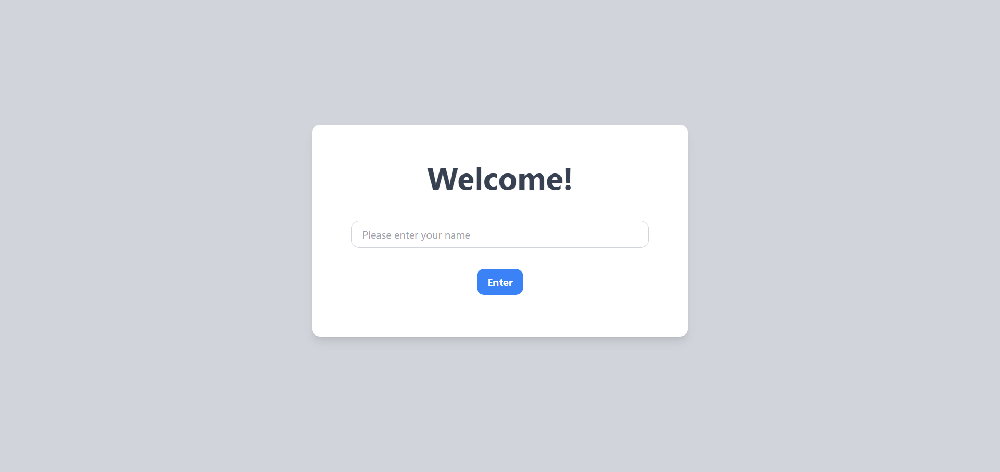
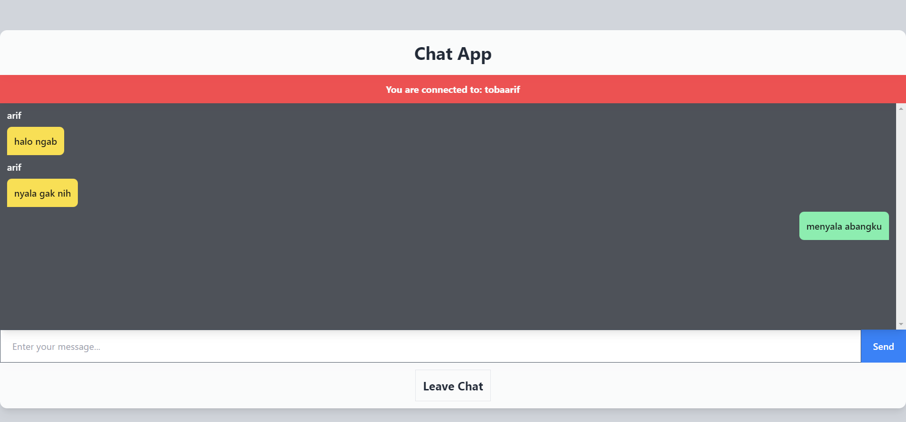

# ChatApp

## deskripsi

-  Merupakan aplikasi simple chatapp ditujukan sebagai bentuk pembelajaran dalam menerapkan fitur real-time iinteraksi antara user yang login
- Aplikasi ini dirancangan dengan menggunakan:

- ### Server
    - Express
    - SocketIO
    - Sequelize

- ### Client
    - React
    - Context
    - SocketIO Client
    - Sweetalert2
    - Tailwind

## setup

- server
  `npx nodemon app.js`

- client
  `npm run dev`

## tampilan
- Register/Login

  

- Home

  
